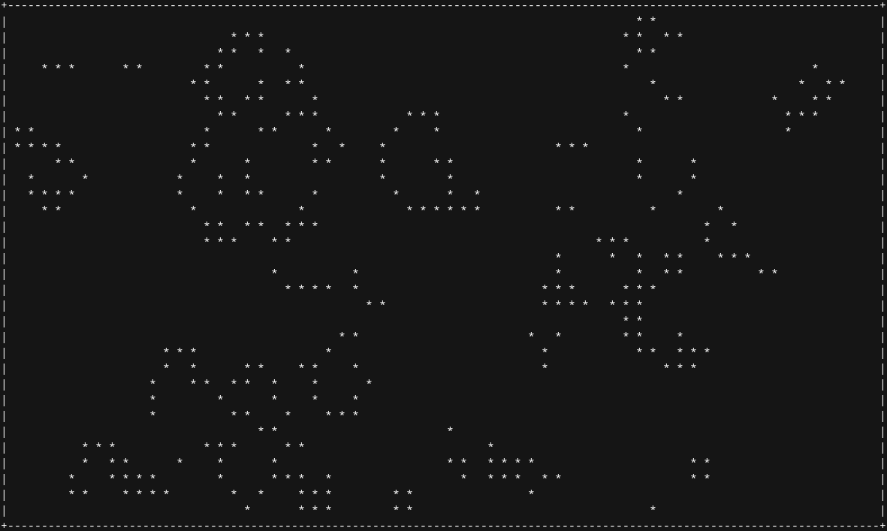

# CONWAY's GAME OF LIFE

This is a simple, terminal based, implementation of John Conway's Game of Life. Conway's Game of Life
is a 2D celular automata that consists in only 4 rules:

1. Any live cell with fewer than two live neighbors dies, as if by underpopulation.
2. Any live cell with two or three live neighbors lives on to the next generation.
3. Any live cell with more than three live neighbors dies, as if by overpopulation.
4. Any dead cell with exactly three live neighbors becomes a live cell, as if by reproduction.

At the start of the game, the initial state of the cells is randomized. In subsequent generations or iterations,
the previously mentioned four rules are applied to each individual cell, and their state updated. The rules
continue to be applied repeatedly to create future generations.

## USAGE

Compile the program with your compiler of choice.

1. `gcc game_of_life.c -o game_of_life`

Execute the program by passing the dimensions of the grid, and optionally, the density of living cells in the starting seed.

2. `./game_of_life <height> <width> <density>`
